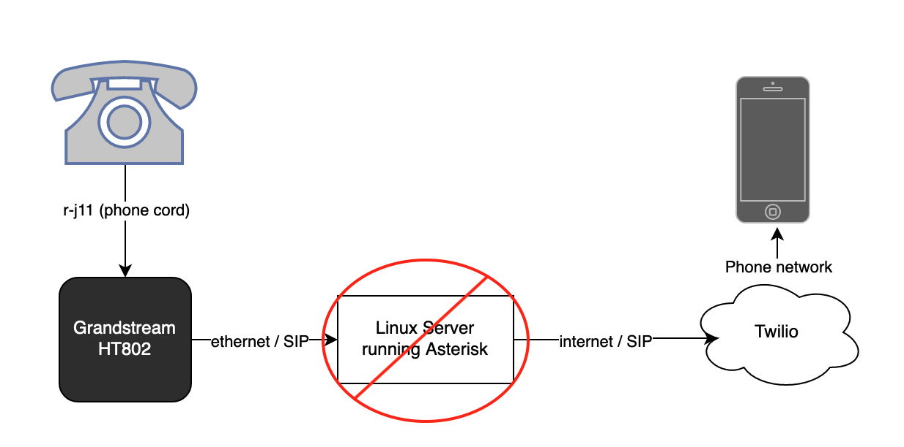
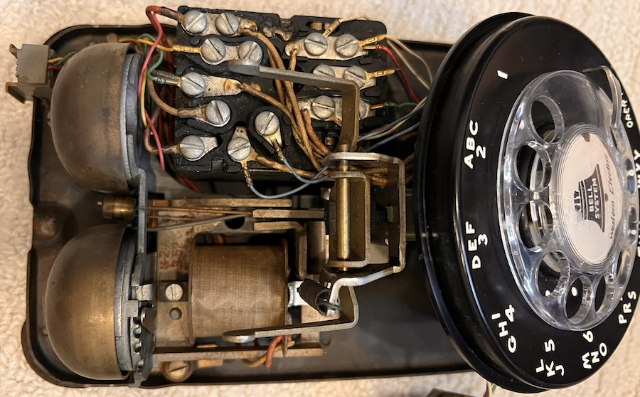

# Rotary Phone Project

This is my version of the rotary phone project previously described
[here](https://github.com/mnutt/rotary).

I tried following those steps exactly, including setting up asterisk (which was
a completely new and strange world to me), and, in the end, was defeated by the
arcane SIP configuration, networking problems, and version incompatibilities of
dockerized asterisk. So, my version of this project skips asterisk altogether,
and connects directly to Twilio.

Twilio does provide what appears to be a rather robust framework for writing
your own functions in javascript to handle incoming and outgoing calls, although
there is some strange inconsistencies in their platform that I have not
completely figured out. But the important thing is, it works, and my kids are
happily calling their grandparents and aunts and uncles.


## Features
Inspired by Michael Nutt's project, I too wanted an old fashioned rotary phone,
essentially indestructible, that my kids could actually use to make real phone
calls to a pre-selected list of contacts.

* I like encouraging independence, and for them to be able to contact people
  they know and love, when they feel like it, and have a conversation without me
  there, listening in, seems like a great and safe thing to encourage.
* Be able to "call the house". This is something that was lost in the fairly
  recent past, the idea that you could call a *place*, rather than a person, and
  anyone who hears the ring could answer. I find that I'm using this more than I
  expected, as my significant other has much better smart phone hygeine than I
  do, and therefore is often living her life blissfully free of her device.
  However, if I am, say, at the grocery store, and need a timely opinion, it's
  very nice to be able to ring a phone at the house, and she or even either of
  the kids can hear it and pick it up. With Twilio, you can limit the allowed
  callers to a pre-defined list, so no spam.
* I stopped here for now, and have not done some of the more advanced things
  that Michael did in his version, such as an extension for telling a joke, or
  getting MTA train status (no trains in my small town). But, I think many of
  these things could be recreated using Twilio's functions.

## Equipment

I used the same phone as in `mnutt`'s project, and the same Grandstream
GS-HT802, both of which worked great. I did try and try to get asterisk working,
but to no avail. So, I removed that from the mix. Quoted from his project:

>60 years ago, every household in America had one or more rotary phones, so they're not exactly hard to find. I bought one off of Ebay for ~$25. Not all of them are guaranteed to be in working order, but these things are pretty solid so if the outside looks undamaged, it's likely alright. Worst case you might have to spend another $25 and try again. I got a [Western Electric Bell 500](https://en.wikipedia.org/wiki/Model_500_telephone).

>If we lived in 1960 (or even 2000) I could plug it into the wall and the project would be mostly done. But if I want to do anything interesting, I need to adapt it to VoIP. My initial thought was to hack up the inside of the phone and use a Raspberry Pi or ESP32 or something, but between driving 48V DC or replacing most of the internals it seemed a bit out of reach. Instead, I used the phone unmodified and connected it to a [Grandstream GS-HT802](https://www.grandstream.com/products/gateways-and-atas/analog-telephone-adaptors/product/ht802) which lists rotary support in the specs. This currently goes for ~$50 [on Amazon](https://www.amazon.com/Grandstream-GS-HT802-Analog-Telephone-Adapter/dp/B01JH7MYKA).

>~~To accomplish the other features, I wanted to use Asterisk, an open source PBX. Using Asterisk to make a phone that tells you jokes is a bit like using Kubernetes to host your blog, but I had a little bit of experience with it from ~20 years ago and it seemed to do everything I wanted. Ideally I would have been able to attach the Grandstream adapter directly to the machine running the Asterisk server. But for the equipment I had, I ended up attaching the Grandstream to the Raspberry Pi in my son's room, and having it bridge wifi to an old server under my desk running Asterisk. This hasn't flaked out yet but seems like it could be brittle. At some point I'd like to consolidate these into a more powerful Raspberry Pi 5 that runs Asterisk and is directly connected to the GrandStream.~~

My lightly edited diagram:



## Rotary Phone Setup

Per Michael:

>Pretty much just plug the RJ11 port of the phone into port 1 on the GrandStream. This should mostly Just Work, but there are some potential caveats depending on the rotary phone you receive. I'd try it first, but if you have trouble with it ringing later in the process you can try:

>* It's possible that your phone has been wired for a "party line" instead of
>  regular service. This would require unscrewing the cover (make sure it's
>  unplugged from the Grandstream) and a small amount of rewiring which differs
>  based on your phone model.
This was the case on the phone that I bought. I found a youtube video for my
phone model that showed how to rewire it. It was very simple, literally
unscrewing a wire from one terminal and attaching it to a different one.
>* The one I received _wasn't_ wired for a party line, but was effectively
>  muted. I had to take the cover off and unhook part of the ringer. I haven't
>  seen discussion of this online anywhere.

I had a slightly different problem with making the ringer work on incoming
calls. After re-wiring, the ringer did work on incoming calls, but it sounded as
though the solenoid was too weak to actually move the clapper and ring the
bells. It would make a weak buzzing, and if I got the clapper started with my
finger, the bells would ring. But it didn't have quite enough oomph to get the
clapper going by itself. Moving the little wire (apparently called the bias
wire) to the other position fixed it.

>Opening it up:

>

>After everything else checked out, I realized the ringer had been locked, and
>moved it to this position to fix:

This is the bias wire, not a mute or ringer lock. See which position works best
on your setup:

>

## Connecting the phone to Twilio

Once you plug in your Grandstream to an active ethernet connection, go to your
router and create an IP reservation for that device (I'm not actually sure this
is absolutely necessary for phone connectivity, but probably a good idea. And it
makes finding the device admin IP easier.)

Go to the device web admin panel (http://device-ip-address), and use the default
login `admin/admin`.

Now go open a Twilio account.

* You can accept whatever phone number they give you when you start the free
  trial, or buy a number local to your area. I just went with the Toll-free
  number they assigned me.
* In order to actually make and recieve calls, you have to upgrade your account
  and add funds (I think $20 increments, with the option to auto-refill).
* Create a [SIP Domain](https://console.twilio.com/us1/develop/voice/manage/sip-domains)
* Create a Credential List. This is how the Grandstream will authenticate with
  Twilio. Set up Voice Authentication with the Credential List.
* Enable SIP Registration.

Back in the Grandstream settings, go to the `fxs-1` tab, and set:

```
Active: Yes
Primary SIP Server: [SIP domain address from twilio, i.e. [name].sip.us1.twilio.com]
<!-- NAT Traversal: Keep-Alive * -->
SIP User ID: rotary
SIP Authenticate ID: rotary
SIP Registration: Yes
Enable SIP OPTIONS/Notify Keep-Alive: OPTIONS *
Enable Pulse Dialing: Yes
Enable Hook Flash: Yes
Enable High Ring Power: Yes **

* - only required because of the RPi wifi bridge
** - maybe not necessary, but makes ringer more likely to work
```

I also had to go to `Advanced Settings` and set:
```
STUN server is: stun.l.google.com:19302
```

Replace the host with the host from the SIP Domain you created in Twilio. And replace `defaultuser` and `remotesecret` values with the username and password from the Credentials List you created.

* `qualify=yes` will cause Asterisk to keep the NAT hole alive by periodically sending OPTIONS requests. 
* `defaultexpiry` and `minexpiry` keep us from sending so many pings that Twilio rate-limits us. 
* `context=from-twilio` means that incoming calls will wind up in the `from-twilio` context in `extensions.conf`, where you can route them to your rotary phone:


#### Dialing out

With the connection established, we need to tell Asterisk how to route a call to Twilio, and need to tell Twilio what to do when it gets it.

Asterisk config, in `extensions.conf`:

```
exten => 81,1,Answer() ; Call Dad
 same => n,GoSub(speak,s,1("Calling dad\!\!"))
 same => n,Set(CALLERID(all)="Rotary"<19787777777>)
 same => n,Dial(SIP/twilio/+12565121024)
```

In this case you'd replace `19787777777` with the Twilio phone number you purchased, and `12565121024` with the number you're calling. I'm not entirely sure the caller ID part is necessary, but it seems like it.

Back in Twilio, we want our SIP domain to receive a call and pass it right on through via our purchased phone number. To do this we can create a [TwiML bin](https://console.twilio.com/us1/develop/twiml-bins/twiml-bins):

```
<?xml version="1.0" encoding="UTF-8"?>
<Response>
    <Dial answerOnBridge="true" callerId="{{#e164}}{{From}}{{/e164}}">{{#e164}}{{To}}{{/e164}}</Dial>
</Response>
```

Give it a name like "OutboundCall", then go back to the SIP Domain configuration:
* Set Call Control Configuration to configure with "Webhooks, TwiML Bins, Functions, Studio, Proxy"
* A call comes in: set to "TwiML Bin" then select your bin name
* The rest of the fields don't matter

Make sure SIP routing is Active.

Now try dialing "81" from your rotary phone. It should route to your recipient.

I went back and forth a bit on setting up emergency service. (911, in the US) If you do this, you'll absolutely want to make sure your home address in Twilio is accurate. I haven't set up emergency dialing yet because while I can impress on my son the serious nature of calling 911, his friends might treat it more like a toy. Still, something worth considering.

#### Receiving calls

With our outbound setup, Asterisk could technically dial _any_ number but we limit which numbers can actually be dialed by only explicitly dialing them in `extensions.conf`. For receiving calls, we want to make sure we also limit it to specific callers. We could easily achieve "pass any call through" with the same TwiML Bin approach, but "limit to phone numbers x,y,z" is a bit too much for TwiML so I opted for a Twilio Function.

In Twilio, [create a Service](https://console.twilio.com/us1/develop/functions/services) to make a new function. I named mine `incoming-call`, with this logic:

```javascript
const allowed = ['+12565121024', '+13435555555', ...];

exports.handler = function(context, event, callback) {
    console.log("Receiving call", event.From);
    let twiml = new Twilio.twiml.VoiceResponse();

    if(allowed.includes(event.From)) { // Ensure the number is in E.164 format
        console.log("Matched, dialing...");
        const dial = twiml.dial({answerOnBridge: true}).sip("rotary@replace-with-your-sip-name.sip.twilio.com");
    } else {
        console.log("Call was rejected");
        twiml.reject(); // Rejects the call if the number does not match
    }

    callback(null, twiml);
};
```

Make sure you save and click "Deploy all" to actually deploy it.

Then go to Phone Numbers -> Manage -> Active Phone Numbers and select the number you purchased to configure it. Choose "Webhooks, TwiML Bin, Function, Studio Flow, Proxy Service", then choose "Function" and the one you named `incoming-call` and choose the Environment and Function Path. (there should be only one option for each)

At this point, you can go back to the Function editor, enable Live Logs, and actually try to call your Twilio number and see it route the call. It'll send it on to Asterisk, who will probably immediately dump it since you haven't configured anywhere for it to go. We can do that in `extensions.conf`:

```
[from-twilio]
exten => s,1,NoOp(Incoming Call)
 same => n,Dial(SIP/rotary)
 same => n,Hangup()
```

This is where you could put other fancy logic, for instance if you wanted to let other people call you and hear MTA announcements or something.

At this point you should be able to dial your Twilio number from your cell phone and, with a great deal of luck, your rotary phone will ring.

## Conclusion

The physical aspects of the project held my son's attention the best, especially taking the phone cover off. (make sure it's unplugged!) Debugging SIP connections was by far the most tedious part of the project and I did most of that at night. But building out the phone menu was also a fun activity where I let him dictate what the numbers did and we drew out how it would work.

By far the best part of the project is that he'll randomly call up his grandparents to talk. As an adult I talk to loved ones on the phone, but calls tend to be scheduled and coordinated in advance via text. An unexpected call triggers annoyance or concern. Four year olds have none of that, and are happy just to chat.
